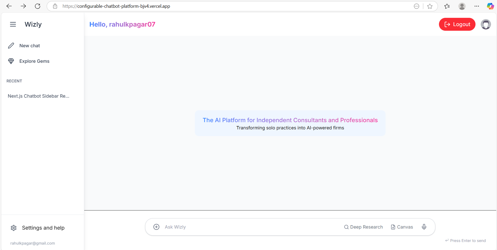
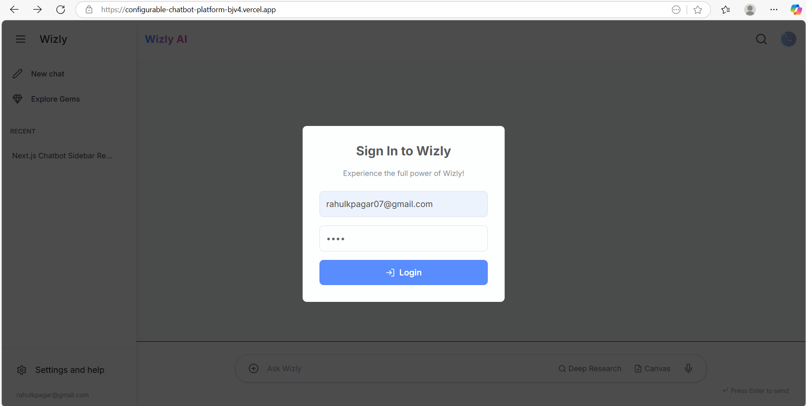

<p align="center">
  
  <h1 align="center">Wizly Chat UI</h1>
</p>

<p align="center">
  The AI Platform for Independent Consultants and Professionals.
  Transforming solo practices into AI-powered firms through an intuitive chat interface.
</p>

<p align="center">
  <a href="#features"><strong>Features</strong></a> ·
  <a href="#live-demo"><strong>Live Demo</strong></a> ·
  <a href="#screenshots"><strong>Screenshots</strong></a> ·
  <a href="#running-locally"><strong>Running locally</strong></a>
</p>
<br/>

## ✨ Features

This project focuses on delivering a robust and user-friendly frontend experience for a configurable chatbot platform, aligned with the assignment's "Frontend Focused" objective.

-   **Intuitive Chat Interface:** Engage with the AI seamlessly using a clean and responsive chat window.
-   **Text & Voice Input:**
    * Send messages via text input.
    * Simulated voice input capability for an enhanced user experience.
-   **File Attachment Simulation:** Users can "attach" files (images, documents), which are then acknowledged by the dummy AI response.
-   **Mock Authentication Flow:**
    * A smooth, transparent backdrop Sign In popup appears on first visit.
    * Allows login with *any* mock email and password, demonstrating a client-side authentication state.
    * Dynamic header displaying logged-in user's name and a logout option.
-   **Dynamic Welcome Message:** A custom welcome message "The AI Platform for Independent Consultants and Professionals" is displayed upon successful login, transitioning smoothly into view.
-   **Responsive Design:** Optimized for a consistent experience across various devices, from desktop to mobile.
-   **Thinking/Recording Indicators:** Visual feedback (spinners, pulsing mic) when the AI is processing or voice input is active.

## 🚀 Tech Stack

* **Framework:** [Next.js 14](https://nextjs.org/) (with App Router and `use client` for interactivity)
* **UI Library:** [React.js](https://react.dev/) (Functional Components & Hooks)
* **Styling:** [Tailwind CSS](https://tailwindcss.com/) for rapid and utility-first styling.
* **Icons:** [Lucide React](https://lucide.dev/) for crisp, customizable icons.
* **Language:** [TypeScript](https://www.typescriptlang.org/) (strongly preferred, for type safety and better developer experience).
* **Simulations:** `Web Speech API` (simulated for voice input).

## 🌐 Live Demo

Experience the Wizly Chat UI live:

**[Your Deployed Application Link Here]**
(e.g., `https://configurable-chatbot-platform-bjv4.vercel.app/`)

**To Test the Mock Login:**
On the sign-in popup, you can enter **any email ID** (e.g., `mock@example.com`) and **any password** to proceed and explore the chat interface.

## 📸 Screenshots

Here are a few glimpses of the Wizly Chat UI in action:

**Sign In Popup**


**Chat Interface (Logged In - Welcome Message)**


## 🛠️ Running Locally

Follow these steps to set up the project on your local machine:

1.  **Clone the repository:**
    ```bash
    git clone [YOUR_REPO_URL_HERE]
    cd [your-repo-name]
    ```
2.  **Install dependencies:**
    ```bash
    npm install
    # or
    yarn install
    ```
3.  **Run the development server:**
    ```bash
    npm run dev
    # or
    yarn dev
    ```
4.  **Open in browser:**
    Your application should now be running on [http://localhost:3000](http://localhost:3000).

**Note on Backend Features:**
As this assignment was frontend-focused, backend features like real JWT authentication, persistent data storage for configurations/conversations, and the Admin Dashboard functionalities (analytics, bot configuration CRUD) are currently **simulated/mocked** using client-side state and dummy logic.

---